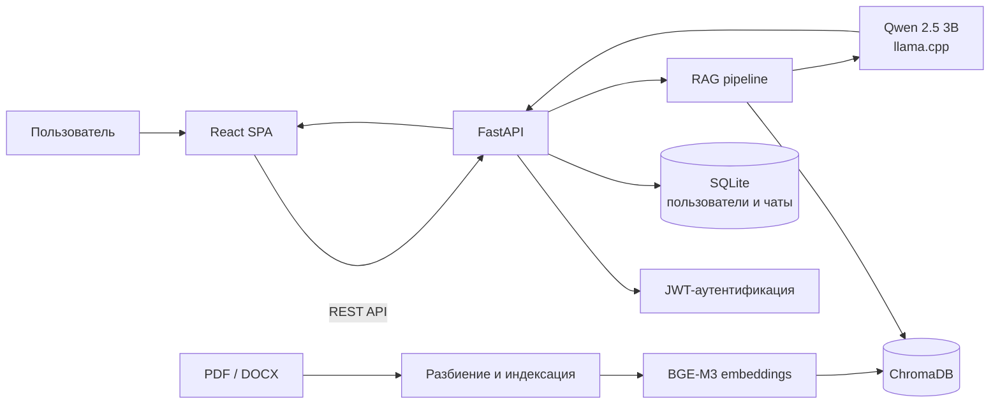

<div align="center">

# 🚆 Интеллектуальный ассистент для локомотивного депо

### RAG-система технической поддержки ремонтного персонала

Прототип веб-приложения для кейса АО «Желдорреммаш», который помогает<br>
ремонтному персоналу находить информацию в технической документации.

### 🥉 3-е место на хакатоне РУТ МИИТ

**Команда «Джин» · Финансовый университет**


</div>

---

## О проекте

Проект разработан командой **«Джин»** в рамках хакатона, проходившего в Москве
на базе Российского университета транспорта (РУТ МИИТ). Команда представляла
**Финансовый университет при Правительстве Российской Федерации** и по итогам
соревнования заняла **3-е место**.

### Кейс

> **«Разработка интеллектуального ассистента на базе RAG для технической
> поддержки ремонтного персонала локомотивного депо»**

Кейс был представлен **АО «Желдорреммаш»**. Задача проекта — создать единый
интерфейс для взаимодействия с локальным AI-ассистентом, который помогает
ремонтному персоналу получать ответы по руководствам, регламентам, инструкциям
по техническому обслуживанию и ремонту локомотивов.

Пользователь может зарегистрироваться, создать отдельные тематические диалоги,
задавать вопросы и возвращаться к истории общения.

Ассистент использует RAG-подход: перед генерацией ответа система выполняет
семантический поиск по загруженным PDF- и DOCX-документам. Если релевантной
информации недостаточно, ассистент просит уточнить запрос и не придумывает ответ.

📁 [Материалы кейса АО «Желдорреммаш»](https://drive.google.com/drive/folders/1RcWudsaYETpATWiNG_o9Y51aqsm4h-L7?usp=sharing)

> Проект является хакатонным прототипом и не является официальным продуктом
> АО «Желдорреммаш».

---

## Возможности

- регистрация и авторизация пользователей;
- JWT-аутентификация и проверка активной сессии;
- создание нескольких тематических чатов;
- сохранение истории сообщений;
- отображение времени отправки сообщений;
- состояние ожидания ответа ассистента;
- автоматическая прокрутка к последнему сообщению;
- отправка вопроса кнопкой или клавишей `Enter`;
- поиск информации по технической документации;
- локальная генерация ответов без обращения к облачной LLM;
- обработка документов в форматах PDF и DOCX;
- инкрементальное обновление векторной базы при изменении документов.

---

## Мой вклад

В рамках командной разработки моей основной зоной ответственности был
**frontend приложения**. Я занимался пользовательским интерфейсом и связыванием
клиентской части с backend API.

### Что я реализовал

- стартовый экран продукта;
- формы регистрации и авторизации;
- клиентскую валидацию введённых данных;
- хранение и передачу JWT-токена;
- проверку сессии при запуске приложения;
- SPA-маршрутизацию и страницу `404`;
- основной интерфейс чата;
- боковую панель с историей диалогов;
- создание и переключение между чатами;
- загрузку и отображение истории сообщений;
- разные визуальные состояния сообщений пользователя и ассистента;
- индикатор ожидания ответа;
- автоматический скролл диалога;
- отправку сообщений с клавиатуры;
- обработку базового форматирования текста ответа;
- интеграцию React-интерфейса с FastAPI endpoints;
- стили, интерактивные состояния и анимации интерфейса.

Работа над проектом включала не только вёрстку, но и проектирование
пользовательского сценария: от первого входа и авторизации до создания диалога,
отправки вопроса и получения ответа от AI-системы.

---

## Как работает приложение



1. Пользователь создаёт чат и отправляет вопрос через React-интерфейс.
2. Frontend передаёт запрос в FastAPI.
3. Backend ищет подходящие фрагменты в векторной базе ChromaDB.
4. Найденный контекст вместе с вопросом передаётся локальной модели.
5. Ответ сохраняется в истории и отображается в интерфейсе.

---

## Frontend

Клиентская часть реализована как одностраничное React-приложение.

### Стек

- React 19;
- JavaScript;
- React Router;
- HTML5 и CSS3;
- Fetch API;
- Local Storage;
- Create React App.

### Основные экраны

| Экран | Назначение |
|---|---|
| Стартовый экран | Знакомство с продуктом и переход к авторизации |
| Регистрация | Создание пользователя и получение токена |
| Авторизация | Вход в существующий аккаунт |
| Чат | Работа с диалогами и AI-ассистентом |
| Not Found | Обработка неизвестных маршрутов |

### Взаимодействие с API

Frontend использует следующие backend endpoints:

| Метод | Endpoint | Назначение |
|---|---|---|
| `POST` | `/reg` | Регистрация пользователя |
| `POST` | `/auth` | Авторизация и получение JWT |
| `POST` | `/check` | Проверка токена |
| `POST` | `/add_chat` | Создание нового чата |
| `POST` | `/get_chats` | Получение списка чатов |
| `POST` | `/messages` | Получение истории сообщений |
| `POST` | `/` | Отправка вопроса ассистенту |

---

## Backend и AI

Backend предоставляет REST API, хранит пользователей и историю диалогов,
индексирует документацию и формирует ответы на основе найденного контекста.

### Стек

- Python;
- FastAPI и Uvicorn;
- SQLite;
- JWT и bcrypt;
- LangChain;
- ChromaDB;
- BAAI/bge-m3;
- Qwen 2.5 3B Instruct;
- llama.cpp.

### RAG pipeline

- загрузка PDF и DOCX;
- очистка и разбиение текста на пересекающиеся фрагменты;
- создание эмбеддингов с помощью `BAAI/bge-m3`;
- хранение векторов в ChromaDB;
- семантический поиск релевантного контекста;
- ограничение контекста с учётом токен-бюджета модели;
- локальная генерация ответа через GGUF-модель;
- краткое резюмирование длинных диалогов.

---

## Структура проекта

```text
VirtualAssistentRZD/
├── frontend/
│   ├── public/
│   └── src/
│       ├── components/      # экраны и UI-компоненты
│       ├── static/          # изображения и иконки
│       ├── styles/          # стили приложения
│       ├── App.js           # маршрутизация и проверка сессии
│       └── index.js
├── backend/
│   ├── documentation/      # база PDF и DOCX документов
│   ├── api_connect.py      # FastAPI-приложение
│   ├── chat_engine.py      # диалоги, поиск и RAG-логика
│   ├── ingest.py           # индексация документов
│   ├── embeddings_local_bge.py
│   ├── llama_cpp_local_llm.py
│   ├── sqlite_connect.py
│   └── requirements.txt
└── README.md
```

---

## Локальный запуск

### 1. Клонирование репозитория

```bash
git clone https://github.com/nezqt3/VirtualAssistentRZD.git
cd VirtualAssistentRZD
```

### 2. Запуск backend

```bash
cd backend
python -m venv .venv
source .venv/bin/activate
pip install -r requirements.txt
```

Для JWT необходимо создать файл `backend/.env`:

```env
SECRET_KEY=replace-with-a-long-random-secret
ALGORITHM=HS256
```

Загрузите локальную GGUF-модель:

```bash
python download_model.py
```

Проиндексируйте документы:

```bash
python ingest.py
```

Запустите API:

```bash
uvicorn api_connect:app --reload --host 127.0.0.1 --port 8000
```

### 3. Запуск frontend

В отдельном терминале:

```bash
cd frontend
npm install
npm start
```

После запуска интерфейс будет доступен по адресу
[`http://localhost:3000`](http://localhost:3000).

> Первый запуск backend может занять дополнительное время: модели эмбеддингов и
> генерации загружаются локально и требуют достаточно оперативной памяти.

---

## Идеи для развития

- адаптивная мобильная версия интерфейса;
- потоковая выдача ответа ассистента;
- отображение использованных источников и страниц;
- удаление и переименование чатов;
- обработка ошибок API непосредственно в интерфейсе;
- настройка адреса API через переменные окружения;
- Docker-конфигурация для единого запуска;
- тесты пользовательских сценариев;
- роли пользователей и разграничение доступа к документам.
